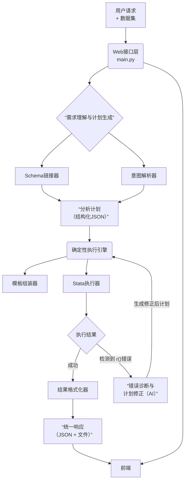

```mermaid
graph TD
    A[用户请求<br>+ 数据集] --> B(Web接口层<br>main.py)
    
    B --> C{“需求理解与计划生成”}
    C --> C1[Schema链接器]
    C --> C2[意图解析器]
    
    C1 --> D
    C2 --> D[“分析计划<br>（结构化JSON）”]
    
    D --> E(确定性执行引擎)
    E --> F[模板组装器]
    E --> G[Stata执行器]
    
    G --> H{执行结果}
    
    H -- 成功 --> I[结果格式化器]
    H -- 检测到 r()错误 --> J[“错误诊断与<br>计划修正（AI）”]
    J -- 生成修正后计划 --> E
    
    I --> K[“统一响应<br>（JSON + 文件）”]
    
    K --> L[前端]
    B --> L
```